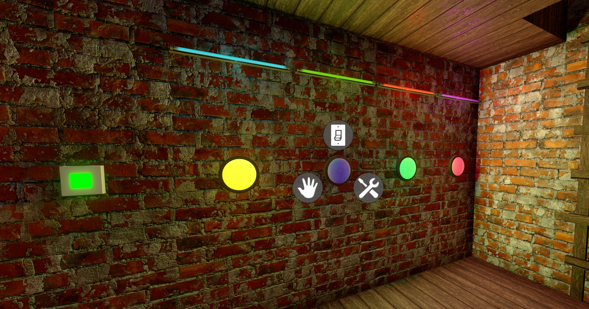
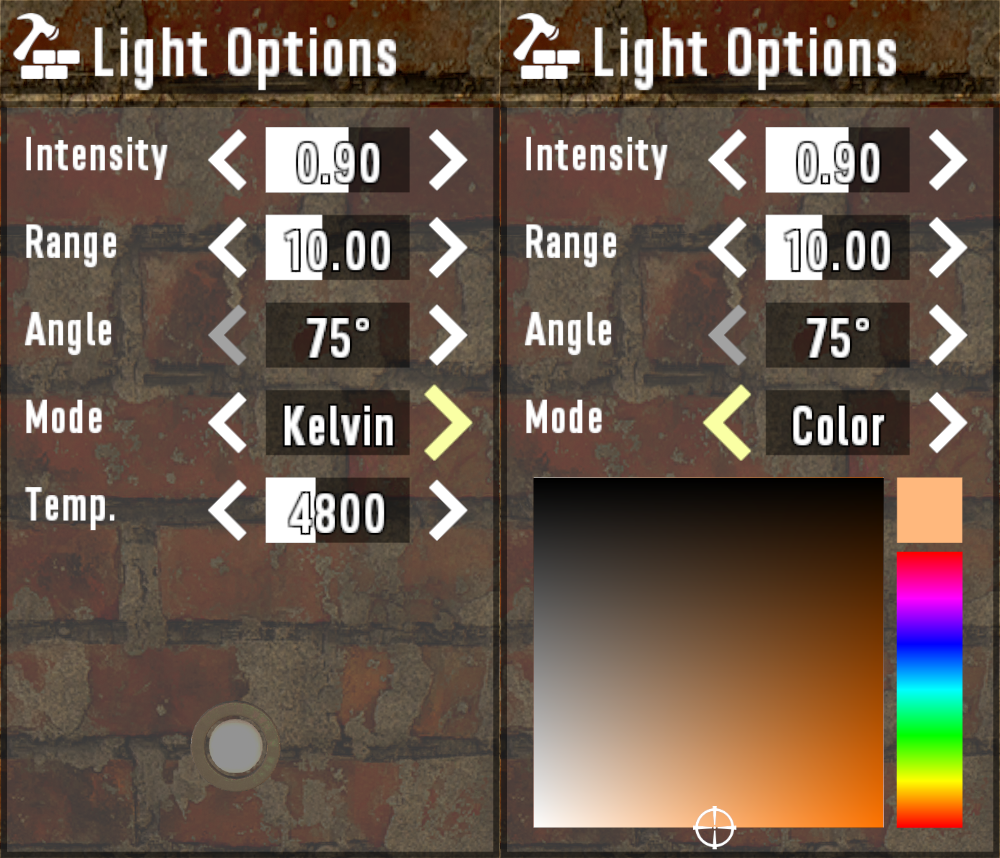
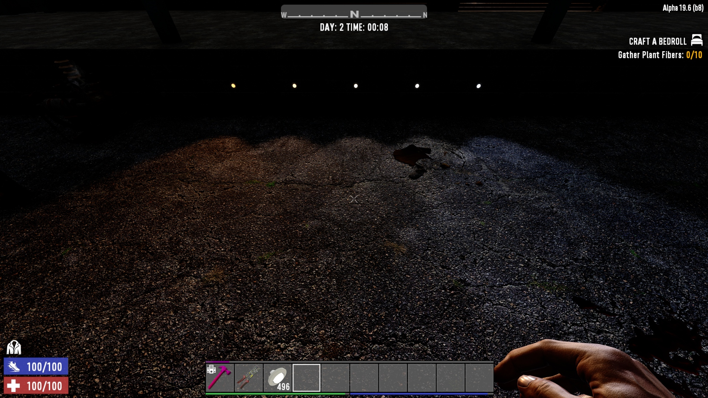
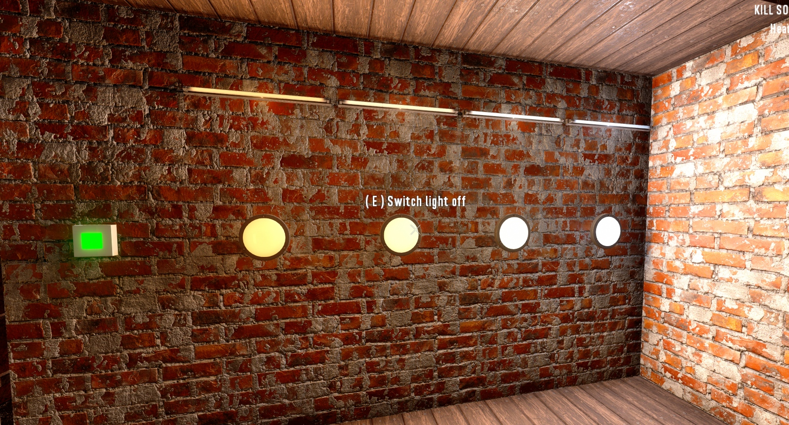
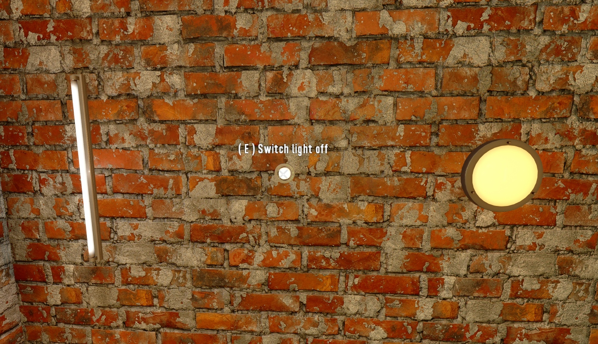
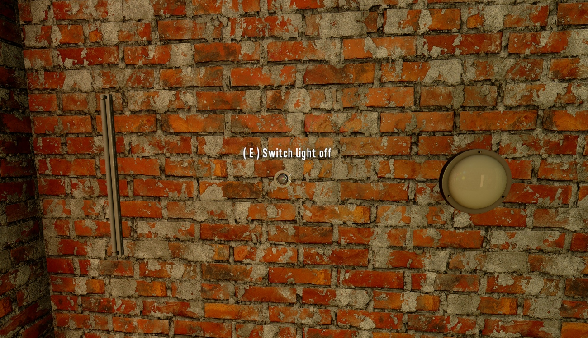

# OCB Electricity Lamps - 7 Days to Die (DMT/Harmony) Addon

This (Harmony) Mod adds new light blocks that support coloring, dimming
and beam angle adjustments (for spotlights only). You will need
[DMT][11] already installed in your game folder to pick-up the
harmony dll from this mod.

https://community.7daystodie.com/topic/25582-new-and-better-electric-lamplight-blocks-dmtharmony/



This Mod is part of my bigger [electricity overhaul][10], but
should also work on its own. Also works in multi-player, but due to
custom resources each client needs to have the mod installed too.



Note: only lamps inside your land-claim can be configured!

The options should be rather self-explanatory, beside range,
where I'm myself unsure what it does exactly. But it should
change unity light range (needs further testing so I left
it in for now for anyone to play around with it).

Spotlights also include an option to adjust the light angle
to widen or narrowing the emitted light cone.

Colors can either be set by Kelvin Temperature or by setting
a color directly via the color picker. Doesn't seem to be super
accurate in regard to real-life, but should be good enough.





## Additional Lights included

I initially developed this mod with three free models from
the unity asset store. I soon found out that the vanilla
lights already included in the game also worked once I had
everything setup. So I created new block for every light
similar to LittleMonstersTV's MOAR Lights mod. The blocks
and recipe files are initially based from that mod.

### 28 MOAR Lights


Since we add 28 new blocks with this mod, I grouped
them together in a few multi-shape helper blocks. This
means that every block in a group has the same recipe.
I had to make some trade-offs in order to group a few
lights together (resources may not always match the
specific type very precisely).

- 2 Illuminated signs (engineer level 2)
- 2 Desk/Table Lamps (engineer level 2)
- 5 Small ceiling lights (engineer level 3)
- 3 Small wall lights (engineer level 3)
- 6 Medium ceiling lights (engineer level 3)
- 1 Medium wall light (engineer level 3)
- 4 Special ceiling lights (engineer level 4)
- 3 Special "ground" lights (engineer level 4)

Additionally there is the Road Block that was
so special that it has it's own recipe!

Note: I had to split the blocks into more groups than
I wanted due to a bug when mixing blocks that need
different `HandleFace` properties. Not exactly sure when
and why this issue occurs though.

### 3 New Light Models

There are currently three different lamp models from the
[Free PBR Lamps Pack (via UnityStore)][1] (thx!). Other lamp
models should be easy to add (see instructions further below).



- Classic neon tube light (ocbCustomLight02)
- Recessed spotlight (ocbCustomLight03)
- Big round ceiling/wall light (ocbCustomLight01)



If you want even more lights to be craftable, I may also
interested you in my additional MOAR lights addon:  
https://github.com/OCB7D2D/ElectricityMoarLights

### How to create your own lights

Creating new lights is very simple, since everything is exposed
into XML. So you simply need to create unity asset bundles with
prefabs with your models and lights included. The rest is simple
XML patching to create new blocks and recipes.

#### Adding new Models

Short overview over the necessary steps. I assume you are already
familiar with unity and how to export a simple cube into 7D2D. If
not you may want to check the Internet for some tutorials.

- Import [`LightLOD`][4] script into unity
- Create root transformation (must leave at defaults!)
  - Create or import a Model (e.g. prefab) at 2nd level
    * Model must have valid collider attached
    * Model must have `B_Mesh` tag set
  - Create a point/spot light at 2nd level
    * Light must have `LightLOD` script attached

Some screenshot to get an idea how it should look:

- [Screens/dev_unity_hierarchy.png][5]
- [Screens/dev_unity_bulb.png][6]
- [Screens/dev_unity_light.png][7]
- [Screens/dev_unity_prefab_apply.png][8]

#### Create new Blocks

Once you created the models, you need to create new blocks so the
player can actually craft them. This fallows the same rules as
regular 7D2D XML modding (so called Modlets). Also check out
the existing [blocks.xml][9] from this repository.

It basically boils down to something like:

```xml:blocks.xml
<configs>
	<append xpath="/blocks">
		<block name="myCustomLamp">
			<property name="Extends" value="ocbCustomLight01"/>
			<property name="Model" value="#@modfolder:Resources/CustomLamp.unity3d?CustomLampPrefab" />
			<property name="DescriptionKey" value="myCustomLampDesc"/>
			<property name="CustomIcon" value="myCustomLamp"/>
		</block>
	</append>
</configs>
```

With that change you can already create the lamp from the creative menu.
But in order for regular player to build them, you also need to add a recipe.

```xml:recipes.xml
<configs>
	<append xpath="/recipes">
		<recipe name="myCustomLamp" count="1"
				tags="perkAdvancedEngineering,learnable"
				craft_area="workbench" material_based="false"
				craft_time="40">
			<ingredient name="resourceHeadlight" count="1"/>
			<ingredient name="resourceForgedIron" count="2"/>
			<ingredient name="resourceScrapPolymers" count="4"/>
			<ingredient name="resourceMechanicalParts" count="1"/>
			<ingredient name="resourceElectricParts" count="4"/>
		</recipe>
	</append>
</configs>
```

Not that our base block set the `UnlockedBy` option, which means that we
also need to add our blocks to the progression system. You may also just
reset those options if you'd like (although I haven't tested this config).

This setting allows blocks to be crafted once engineering level 3 is reached.

```xml:progression.xml
<configs>
	<append xpath="/progression/perks/perk[@name='perkAdvancedEngineering']/effect_group/passive_effect[@name='RecipeTagUnlocked' and @value='1' and @level='2,5']/@tags">,myCustomLamp</append>
</configs>
```

This setting allows the block to be crafted when the book schematic is read.

```xml:items.xml
<configs>
	<append xpath="/items/item[@name='generatorbankSchematic']/effect_group">
		<triggered_effect trigger="onSelfPrimaryActionEnd" action="ModifyCVar" cvar="myCustomLamp" operation="set" value="1"/>
	</append>
</configs>
```

#### Additional Block Options

Our new base block has a few additional settings you can configure via xml:

```xml
<!-- set to point light with kelvins -->
<property name="LightMode" value="1"/>
<property name="LightModeLocked" value="false"/>
<property name="LightKelvin" value="3200"/>
<property name="LightColor" value="1,1,0"/>
<!-- setup basic light options -->
<property name="LightIntensity" value="0.8"/>
<property name="LightMinIntensity" value="0.2"/>
<property name="LightMaxIntensity" value="1.8"/>
<property name="LightIntensityStep" value="0.1"/>
<property name="LightRange" value="10"/>
<property name="LightMinRange" value="0"/>
<property name="LightMaxRange" value="25"/>
<property name="LightRangeStep" value="1"/>
<!-- setup options for spot light -->
<property name="LightAngle" value="95"/>
<property name="LightMinAngle" value="75"/>
<property name="LightMaxAngle" value="135"/>
<property name="LightAngleStep" value="5"/>
<!-- special flag used by lantern --> 
<property name="PowerDontConnect" value="5"/>

```

Most should be quite self-explanatory. The min and max values define the valid
range for this option. The step size is only relevant for the spinners in the
UI and is not really enforced. Finally a default value for each option.

- Mode: Bit-vector holding to state flags
  1) selector colors directly or via kelvin temps
  2) is this a spotlight with angle support
- LightKelvin: Default color (by Kelvins)
- LightColor: Default color (for Picker)
- LightIntensity: Unity light object intensity
- LightRange: Unity light object range
- LingAngle: Unity light object angle

#### Further information

When I first tried to implement better lights, I researched how
original code drives the lights ([using dotPeek][3]). When you
look into `BlockPoweredLights.cs`, you see that 7D2D uses a
strange and unknown `LightLOD` type.

```csharp
    Transform transform1 = blockEntity.transform.Find("MainLight");
    if ((Object) transform1 != (Object) null)
    {
      LightLOD component = transform1.GetComponent<LightLOD>();
      if ((Object) component != (Object) null)
        component.SwitchOnOff(_isOn);
    }
```

I simply tried to [export an AssetBundle from Unity][2] with that class
somehow attached. After some re-search I finally found a similar script
in the asset store which showed me how to achieve this. I guess I was a
bit lucky too, as it seems quite adventurous. Just import a stub
[Mono Script][4] into unity and add it as a component to the light.

```csharp
using UnityEngine;
// Boilerplate only, real objects will be
// instantiated via assembly-csharp.dll
[RequireComponent(typeof(Light))]
public class LightLOD : MonoBehaviour {}
```

The original assembly-csharp.dll will actually be instantiated and
everything just seems to work as intended. Unfortunately the original
code didn't really do very well, since I really simply just want to
enable the emission color on the prefab when turned on (and not show
different meshes). Since I had to hack the class anyway quite a bit
I decided to completely replace it with new `BlockElectricityLight`.

## Recipe changes

The existing recipes for lights are removed, since you can place them
now via the new multi-shape master blocks. The recipes have been cranked
up quite a bit, as pretty much all lights will need at least one headlight,
because you always need a reason to wrench some more cars :)

The two table lamps are unlocked at engineering level 2 (I guess you
could buy a power generator at that level already). These recipes will
need broken glass, which is currently not craftable, but should be easy
enough to come by in the world (look out the window).

Most lights unlock at perk level 3,
Big Ceiling Lights at level 4
and Heavy Duty Lights at level 5.

### Lantern

The lantern is a bit special and needed a few tweaks in this mod, as the base
blocks are now powered and thus allows wired connections, but the lantern is
supposed to light on its own without needing any power (did I say free energy?).
The recipe has been cranked up to include a battery to make it more believable.
I guess adding another solar cell to the mix would be overkill though.

### Road Barricade

Finally I also included the road barricade block for fun. I really have no idea
if there is any real use for it in its current form. It does have a substantial
amount of hit-points (7500). Might be useful to temporarily block an entrance
since you could pick it back up later. For the challenge I've put this recipe
behind the `TechJunkie8Complete` perk, meaning it is only available after you
read all the Tech Junkie Volumes. Ideally we would need to add a schematic to
the game, but haven't yet come around to do that (PRs welcome).

## Tweaking and Fine-Tuning

I have only just roughly adjusted the different lights in terms of parameters.
The idea is that some might be able to go a bit higher than others for some
added power cost (e.g. 2W vs 3W). These settings and limits need further fine
tuning. Also repair, harvest and economic resources are only roughly adjusted.
So if you see something that is odd, open an issue here on GitHub. 

### Change point-lights to spot-lights.

It is actually fairly easy to switch a point-light to a spot-light on runtime.
This solves quite a few issues with some existing models (the ceiling fan
being one of the most obvious ones). Unfortunately the existing point-light
in that model isn't properly rotated (as it doesn't matter with point-lights).
But when we switch it to a spot-light, the rotation gets important. To fix
this I added `LightOrientation` option to re-rotate the new spot-light.

See the following two screens to see the difference [Before][12]/[After][13].

## Changelog

### Version 0.5.1

- Added `LightOrientation` option to realign spotlights
  Finally was able to switch the ceiling fan light to use a
  spotlight that properly points down (looks much better).

### Version 0.5.0

- Fixed light range being constantly overwritten by LightLOD
- Fixed rotation in the unity3d file, meaning your existing lights
  will have the wrong rotation once loaded again. Only solution
  is to pick them up and place them again.
- Added new flag `PowerDontConnect` for lantern edge-case

## Further ideas

- Return variant helper block instead of actual one?
- Could set color temperature directly on Unity lights.
- Could change of lights to spot, which would be often better
  Unfortunately many models don't have it rotated correctly.
- Add configurable `shadowBias` to optimize self shading
- More options are: `shadowRadios`

### Version 0.1.0

- Initial version

## Compatibility

I've developed and tested this Mod against version a19.6b8.

[1]: https://assetstore.unity.com/packages/3d/props/interior/free-pbr-lamps-70181
[2]: https://github.com/7D2D/Templates-and-Utilities
[3]: https://www.jetbrains.com/decompiler/
[4]: Unity/Scripts/LightLOD.cs
[5]: Screens/dev_unity_hierarchy.png
[6]: Screens/dev_unity_bulb.png
[7]: Screens/dev_unity_light.png
[8]: Screens/dev_unity_prefab_apply.png
[9]: Config/blocks.xml
[10]: https://github.com/OCB7D2D/ElectricityOverhaul
[11]: https://community.7daystodie.com/topic/13037-dmt-modding-tool/
[12]: Screens/ingame_lights_overview.jpg
[13]: Screens/ingame_ceilingfan_spotlight.jpg
